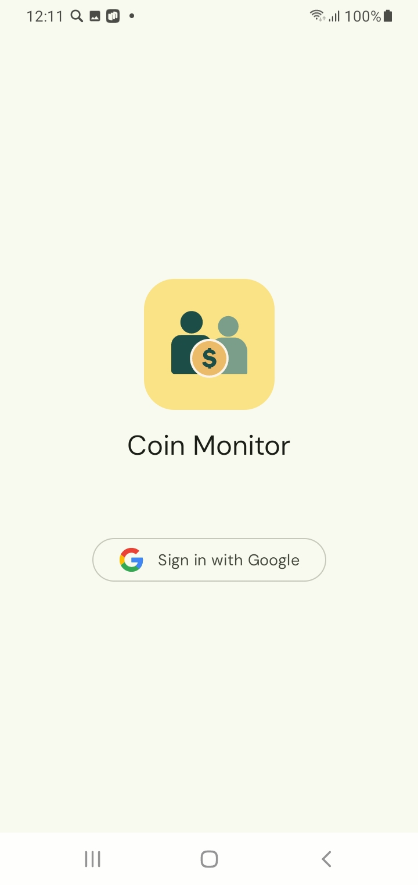
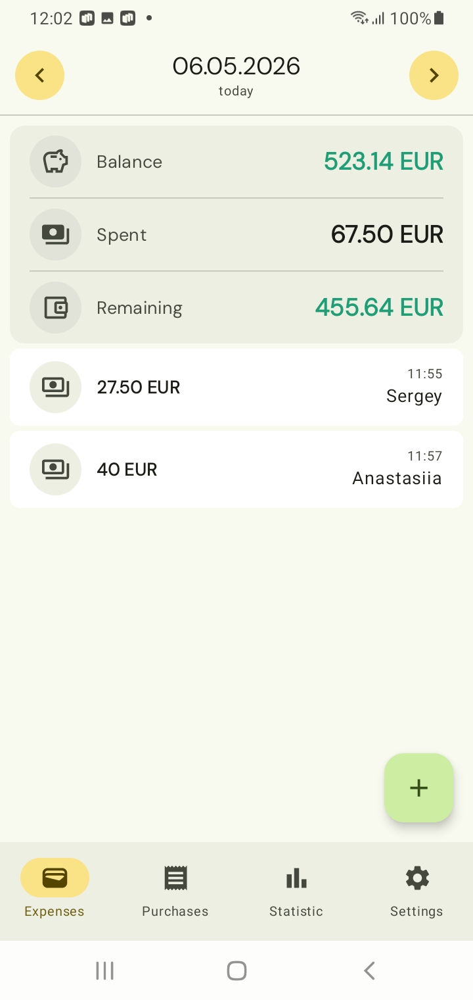
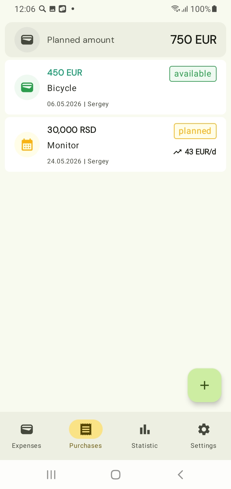
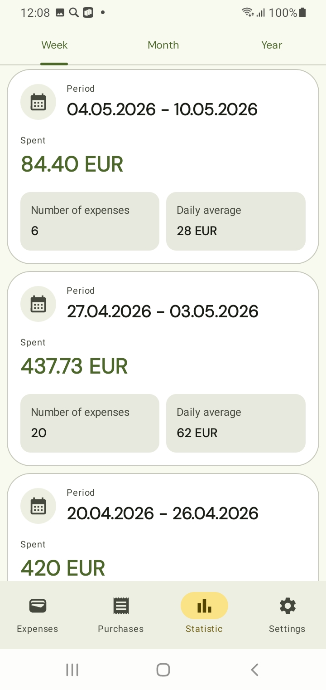
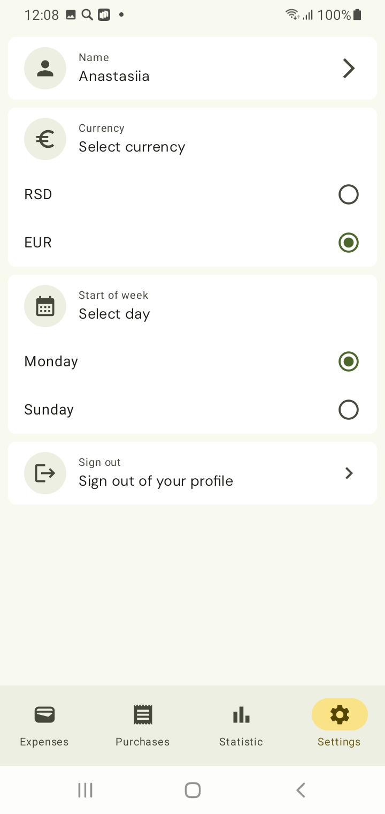

# CoinMonitor

A family application for tracking expenses with offline support and syncing via Firebase.
> ⚠️ Work in progress — not production ready.

## Features

### Available now
- Offline-first expense tracking with Firebase sync
- Two-currency support: **Serbian Dinar (RSD)** and **Euro (EUR)**
- Available balance calculation based on custom formula
- Shared family access via Firebase Auth
- Swipe to delete with undo for transactions
- Automatic exchange rate updates via Frankfurter API
- Planned purchases (large expense scheduling)
- Swipe to delete with undo for planned purchases
- Weekly / monthly / yearly statistics
- Display name customization
- Display currency customization
- Start of week customization (Monday/Sunday)
- Russian and English language support
- Light and dark theme support

### Planned
- Multi-module architecture
- Unit and UI tests

## Tech Stack
- Kotlin, Jetpack Compose, Jetpack Navigation
- Clean Architecture (data / domain / presentation)
- MVI (UiState + Intent)
- Room (single source of truth), Firebase Firestore (sync), Firebase Auth
- Hilt, Coroutines + Flow
- Retrofit2 + OkHttp (exchange rates via [Frankfurter API](https://api.frankfurter.dev))

## Architecture
Room is the single source of truth. SyncRepository manages two-way synchronization with Firestore via `callbackFlow`. Offline operationsare applied locally and synced on the next connection.

## Screenshots

| Login                      | Expenses | Purchases | Statistics | Settings |
|----------------------------|----------|-----------|------------|----------|
|  |  |  |  |  |

## Getting Started
1. Clone the repository
2. Add `google-services.json` to `/app`
3. Open in Android Studio (latest stable recommended)
4. Run on an emulator or device (minSdk 26)